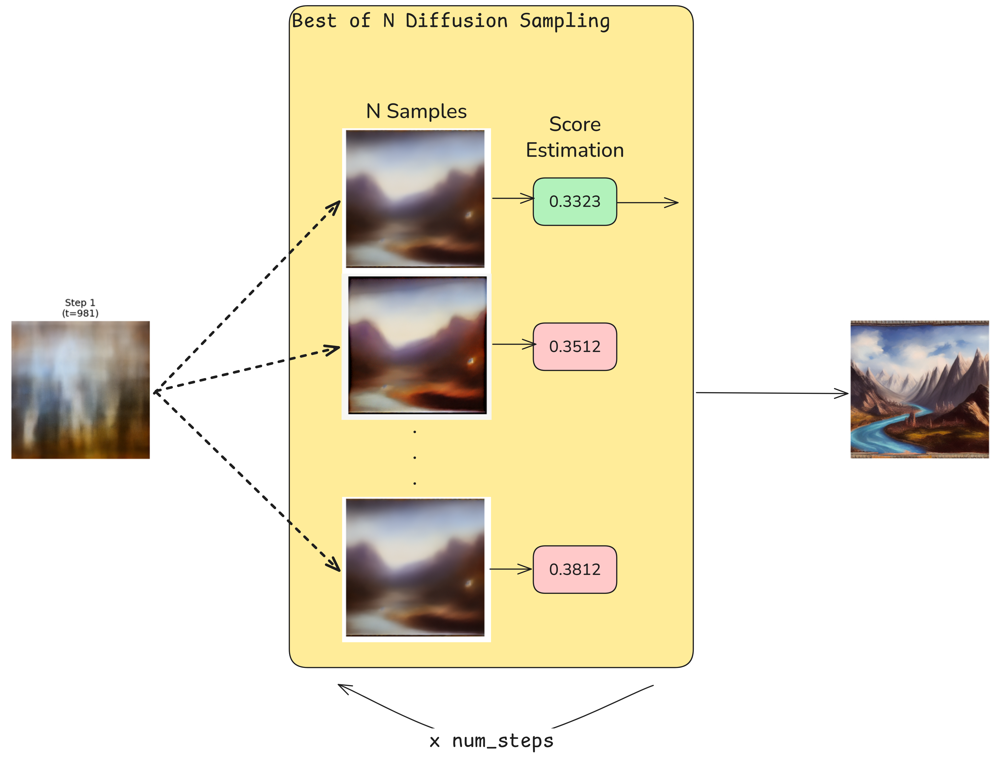

# Enhanced Diffusion Sampling with Search-Based Methods

This project explores advanced sampling techniques for diffusion models that go beyond the standard reverse diffusion process. By implementing search-based methods like Best-of-N sampling and Beam Search, we aim to improve image generation quality by allowing the model to explore more of the generation space and select optimal paths.



## 🎯 Project Overview

Traditional diffusion models follow a deterministic reverse sampling process, generating images step-by-step from noise to final output. This project investigates whether **search-based sampling methods** can improve generation quality by:

1. **Exploring multiple candidate paths** at each denoising step
2. **Evaluating path quality** using forward likelihood estimation
3. **Selecting optimal trajectories** through the generation space

## 🔬 Methodology

### Core Innovation: Forward Likelihood Estimation

We developed a novel **Forward Negative Log-Likelihood (NLL)** metric to evaluate the quality of diffusion model predictions at each step:

```
NLL = 0.5 * log(2π * variance_t) + 0.5 * (||ε_pred||² / d)
```

Where:
- `ε_pred` is the predicted noise
- `variance_t` is the noise variance at timestep t
- `d` is the dimensionality of the latent space
- **Lower values indicate better predictions**

This metric assesses how plausible the predicted noise is under the forward diffusion process, providing a reliable proxy for prediction confidence and model performance.

### Implemented Methods

#### 1. Standard Pipeline (`1_standard_pipeline.py`)
- Baseline implementation using the default Stable Diffusion 1.5 pipeline
- Single deterministic path through the reverse process
- Minimal computational overhead

#### 2. Forward Process Implementation (`2_for_pipeline.py`)
- Manual implementation of the diffusion forward process
- Foundation for implementing custom sampling strategies
- Direct control over each denoising step

#### 3. Likelihood Estimation (`3_step_linkelihood_estimation.py`)
- Implementation of forward NLL computation
- Visualization of prediction quality throughout the sampling process
- Analysis of score function estimates and their statistics

#### 4. Best-of-N Sampling (`4_best_of_N_sampling.py`)
- Generate N candidate samples at each step
- Select the candidate with the lowest forward NLL
- **Excellent results with minimal computational overhead**

#### 5. Beam Search Sampling (`5_beam_search_diffusion_sampling.py`)
- Maintain multiple beams (candidate paths) throughout generation
- Use lookahead evaluation for better path selection
- More sophisticated but computationally intensive approach

## 📊 Key Findings

### Performance Comparison

| Method | Generation Time | Quality Improvement | Computational Overhead |
|--------|----------------|-------------------|----------------------|
| **Standard Pipeline** | ~20 seconds | Baseline | 1x |
| **Best-of-N (N=10)** | ~2 min | ✅ **Significant** | ~6x |
| **Beam Search** | ~1 hour | ❌ **Minimal** | ~100x |

### Best-of-N Sampling Results
- **✅ Excellent image quality improvement**
- **✅ Minimal computational overhead** (~50% increase)
- **✅ Easy to implement and tune**
- **✅ Consistent results across different prompts**

### Beam Search Results
- **❌ Drastically increased computation time** (~1 hour per image on laptop GPU RTX 4050)
- **❌ No visible quality improvement** over Best-of-N
- **❌ Complex implementation with lookahead evaluation**
- **❓ May benefit from better hyperparameter tuning**

## 🚀 Getting Started

### Requirements

```bash
pip install diffusers transformers torch torchvision pillow tqdm numpy matplotlib
```

### Usage

1. **Standard Generation:**
   ```bash
   python 1_standard_pipeline.py
   ```

2. **Best-of-N Sampling (Recommended):**
   ```bash
   python 4_best_of_N_sampling.py
   ```

3. **Beam Search (Experimental):**
   ```bash
   python 5_beam_search_diffusion_sampling.py
   ```

4. **Likelihood Analysis:**
   ```bash
   python 3_step_linkelihood_estimation.py
   ```

### Configuration

All scripts use the same prompt by default:
```python
prompt = "A fantasy landscape with mountains and rivers"
```

Key parameters can be modified in each script:
- `num_inference_steps`: Number of denoising steps (default: 50)
- `guidance_scale`: Classifier-free guidance strength (default: 7.5)
- `N`: Number of candidates for Best-of-N (default: 10)
- `beam_width`: Number of beams for beam search (default: 3)

## 📁 Generated Outputs

The project generates several image files:
- `generated_image.png` - Standard pipeline output
- `generated_image_for.png` - Forward process implementation
- `generated_image_lh.png` - Likelihood estimation output
- `generated_image_best_of_N.png` - Best-of-N sampling result
- `generated_image_beam_search.png` - Beam search result
- `intermediate_x0_predictions.png` - Visualization of intermediate predictions

## 🔮 Future Work (TODO)

### Immediate Priorities

1. **Dataset Generation & Metrics**
   - Generate a comprehensive dataset using different sampling methods
   - Implement CLIP-based automatic evaluation metrics
   - Conduct human evaluation studies for subjective quality assessment

2. **Advanced Search Methods**
   - **Monte Carlo Tree Search (MCTS)** for diffusion sampling
   - Adaptive lookahead strategies
   - Multi-objective optimization (quality vs. speed)

3. **Performance Optimization**
   - GPU memory optimization for batch processing
   - Parallel candidate evaluation
   - Early stopping criteria based on convergence

### Research Directions

4. **Theoretical Analysis**
   - Mathematical foundation for forward likelihood estimation
   - Convergence guarantees for search-based methods
   - Optimal exploration-exploitation trade-offs

5. **Model Improvements**
   - Integration with newer diffusion architectures (SDXL, SD3)
   - Learned evaluation functions instead of hand-crafted NLL
   - Adaptive sampling strategies based on content complexity

6. **Applications**
   - Extension to other domains (audio, video, 3D)
   - Integration with fine-tuned models
   - Real-time generation with search-based quality enhancement

## 🎯 Conclusion

This project demonstrates that **Best-of-N sampling** provides an excellent trade-off between generation quality and computational cost. While Beam Search shows the potential for more sophisticated approaches, it requires significant optimization to be practical.

The forward likelihood estimation method proves to be a valuable tool for evaluating and guiding the diffusion sampling process, opening new avenues for improving generative model performance.

## 📚 Technical Details

### Model Configuration
- **Base Model:** Stable Diffusion 1.5 (`runwayml/stable-diffusion-v1-5`)
- **Scheduler:** DDPM for stochastic sampling
- **Precision:** Float32 for accurate NLL computation
- **Resolution:** 512x512 pixels

### Hardware Requirements
- **Minimum:** CUDA-capable GPU with 8GB VRAM
- **Recommended:** RTX 3080/4070 or better for reasonable beam search performance
- **CPU Fallback:** Available but significantly slower

---

*This project is part of ongoing research into advanced sampling methods for diffusion models. Contributions and feedback are welcome!*
